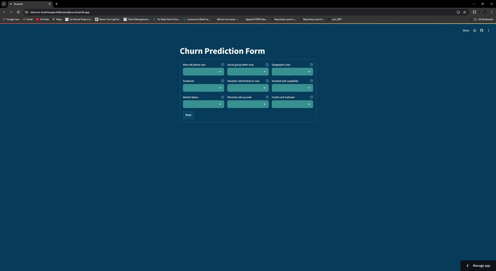
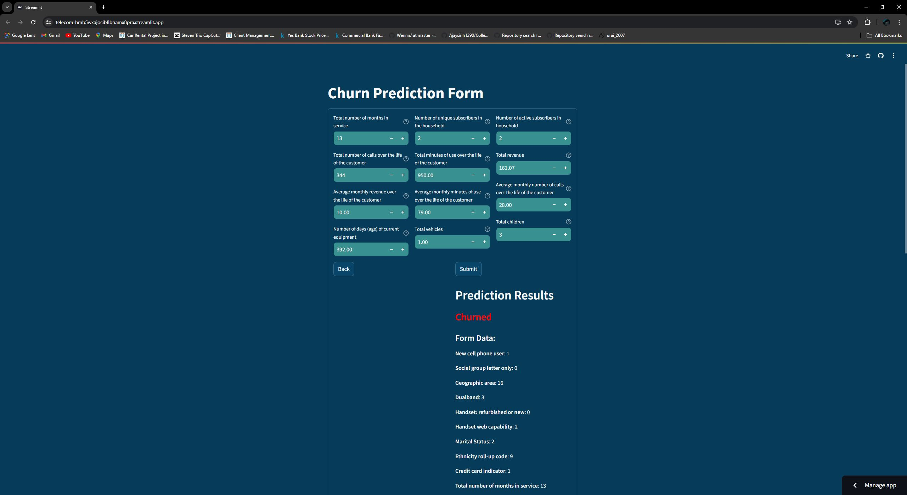
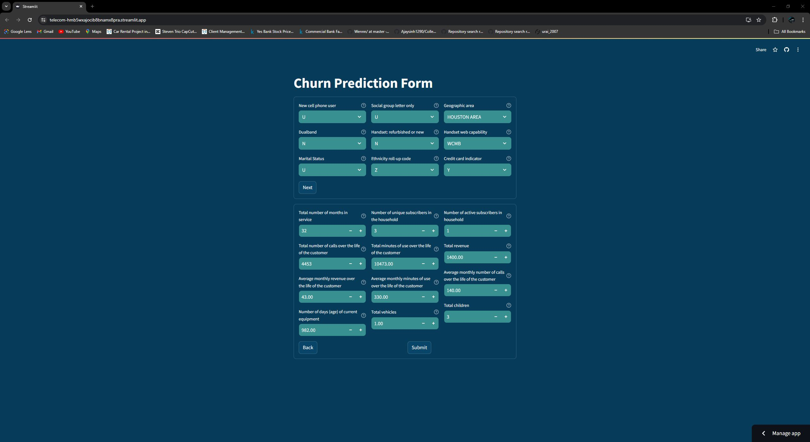
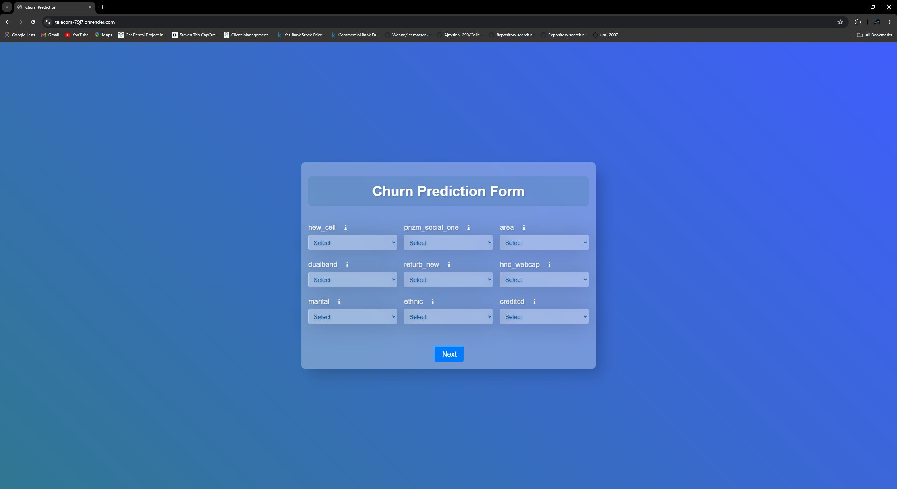
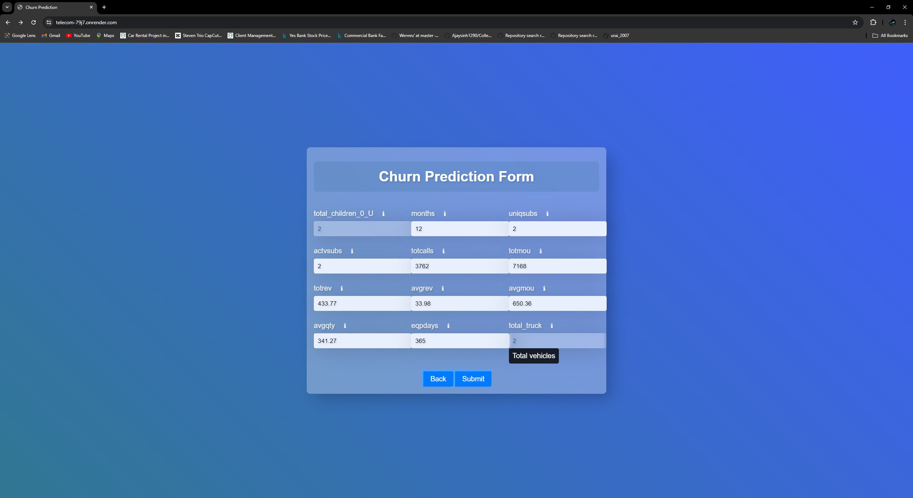
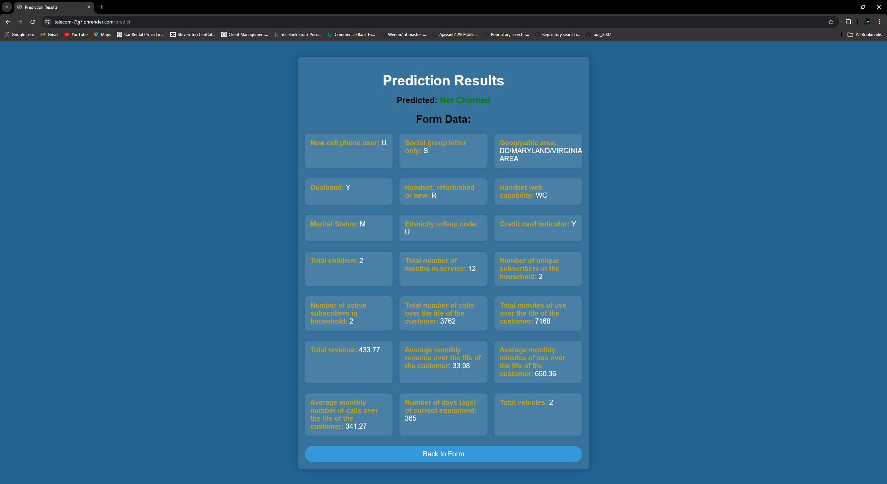
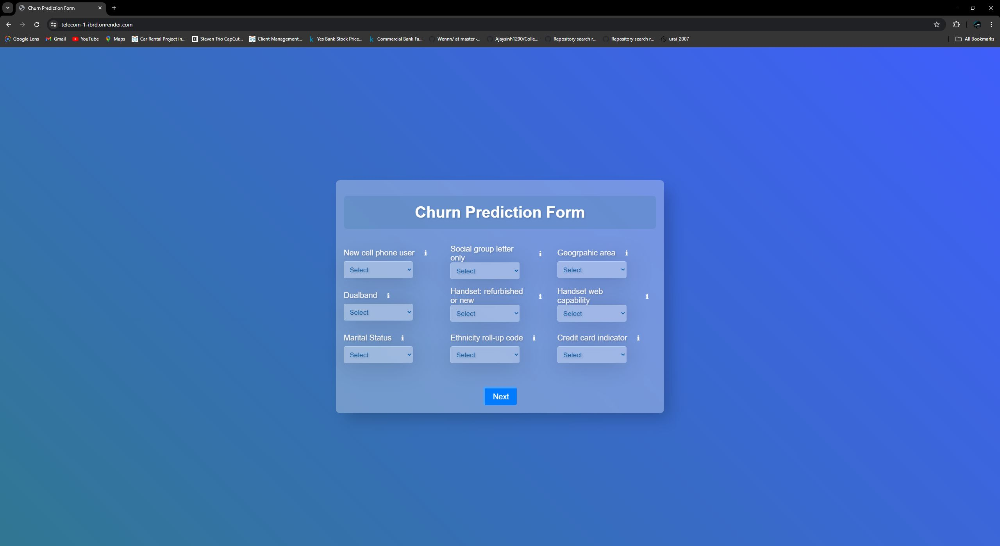
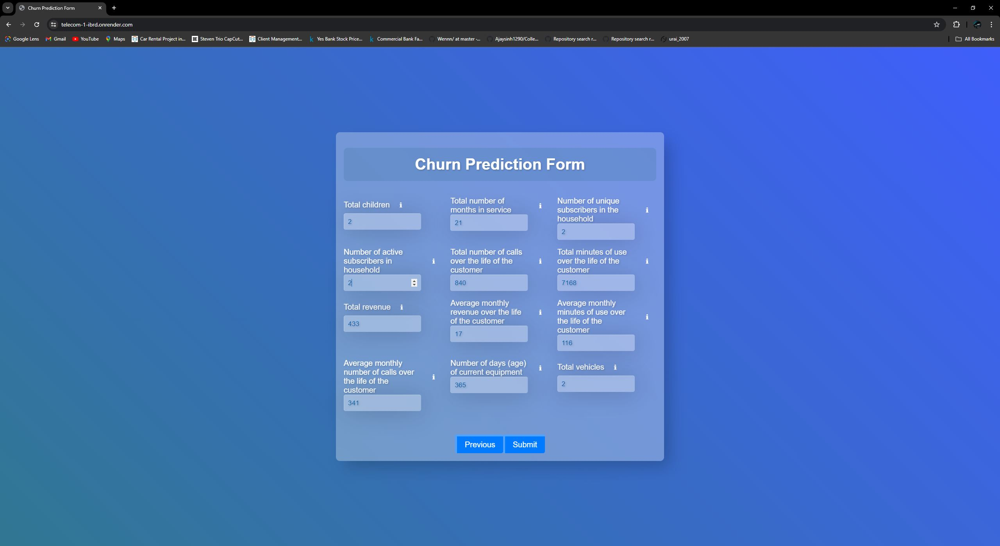
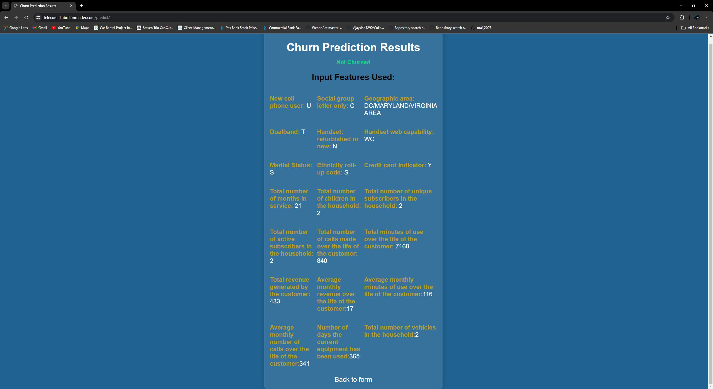

# Customer Churn Prediction

## Project Overview

Customer churn, the rate at which customers leave a service provider for a competitor, is a significant challenge for telecom companies. High churn rates lead to substantial revenue losses, increased customer acquisition costs, and reduced market share. This project aims to develop a predictive model that accurately identifies customers likely to churn, enabling telecom companies to implement proactive retention strategies, improve customer satisfaction, and enhance long-term loyalty.

## Objective

The objective of this project is to develop a machine learning model that predicts customer churn and provides actionable insights to help telecom companies prioritize retention efforts and mitigate churn.

## Dataset

The dataset used in this project contains approximately 100,000 records and 100 variables, including customer demographics, usage patterns, service plans, billing information, and more. The target variable is `churn`, indicating whether a customer has left the service provider.

## Deployment

The model has been deployed using three different frameworks:

- **Streamlit:** [Streamlit App](https://telecom-hmb5wxajocib8bnamx8pra.streamlit.app/)
  
  
  
  

  

  
  
- **Flask:** [Flask App](https://telecom-79j7.onrender.com/)

  
  
  

  
  
- **Django:** [Django App](https://telecom-1-ibrd.onrender.com/)
  
  
  
  
  

